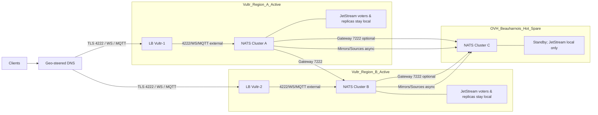

# NATS multi-region topology (active-active Vultr, hot-spare OVH)

This note captures a pragmatic, latency-aware design for running NATS across regions with two active clusters in Vultr (global entry points) and one hot-spare in OVH Beauharnois.

## Objectives
- RPO: 15m (maximum acceptable data loss)
- RTO: 15m (maximum acceptable downtime before service restoration)

## Diagram

## Goals
- Low-latency client access globally via geo-steered DNS to Vultr regions
- Resilient Core NATS routing across regions
- JetStream durability with predictable write latency
- DR cutover to OVH with minimal RPO/RTO

## Core guidance
- Use one NATS cluster per region.
- Connect regions with Gateways (supercluster) only if cross-region subject reachability is required. Otherwise, keep OVH isolated until DR to reduce blast radius.
- Keep JetStream consensus (RAFT voters) and synchronous replicas within a single region. Avoid WAN in the write path.

## Latency constraints (rules of thumb)
- Core NATS (gateways): functionally OK at 100–300 ms RTT, but cross-region traffic adds ~1 RTT to delivery, more for req/reply.
- JetStream RAFT: keep inter-voter RTT < 10–20 ms for predictable elections and write latency. >50 ms hurts; >100 ms typically impractical.

## Recommended topology
- Vultr regions (active):
  - Cluster per region; expose 4222 (TLS), WebSocket (via Ingress), and optional MQTT externally.
  - JetStream: R=3 (AZ spread) with placement tags to keep leader and quorum local.
  - Optional: cross-region async data via stream mirrors/sources for read locality.
- OVH region (hot-spare):
  - Standby cluster. Two options:
    1) Isolated standby (simpler): keep resolver/account state in sync; pre-provision stream definitions; optionally mirror from Vultr (async) to reduce RPO.
    2) Supercluster member (only if needed): connect via gateway with mTLS; keep OVH JetStream replicas/voters local-only; use mirrors/sources for async data.

## Data/state continuity
- Accounts/JWT resolver: use a common operator and system account across all regions. Replicate resolver store (e.g., GitOps/rsync/object storage) to OVH.
- JetStream data: prefer async mirrors/sources across regions. Do not place RAFT voters or synchronous replicas across WAN. For DR promotion, plan for creating writable streams in OVH (mirrors are read-only) using the same subjects.

## Exposure patterns
- Keep the main NATS Service as ClusterIP inside each cluster for internal stability.
- Expose external endpoints with dedicated Services per port (LoadBalancer or TCP Ingress stream config):
  - 4222 (TLS) for clients/CLI
  - 8883 (TLS MQTT) if MQTT is used
  - 7222 (Gateway) restricted to known peer IPs only
- Enforce TLS/mTLS and restrict with NetworkPolicies and cloud firewalls.

## DR cutover outline
1. Ensure resolver and stream configs are current in OVH; mirrors caught up as much as possible.
2. Shift DNS to OVH public endpoints (4222/WS/MQTT).
3. Promote/create writable streams in OVH for producer subjects.
4. Monitor client reconnects and JetStream health.

## Observability
- Track gateway health, slow consumers, and RTT per region.
- Alert on RAFT elections, replica lag, and mirror/source lag.

## Anti-patterns to avoid
- JetStream voters across regions (WAN in the quorum path).
- Exposing internal ports unintentionally by flipping your primary Service to LoadBalancer.
- Relying on gateway port (7222) for client access (clients must use 4222/WS).
